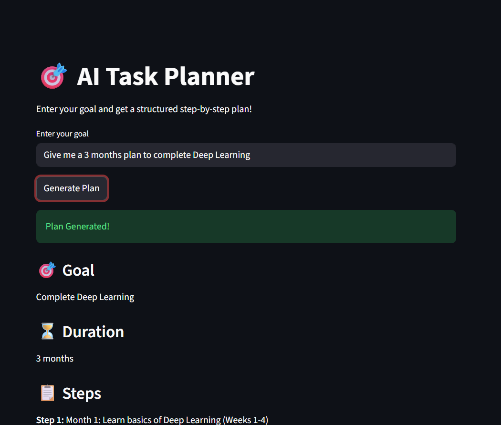
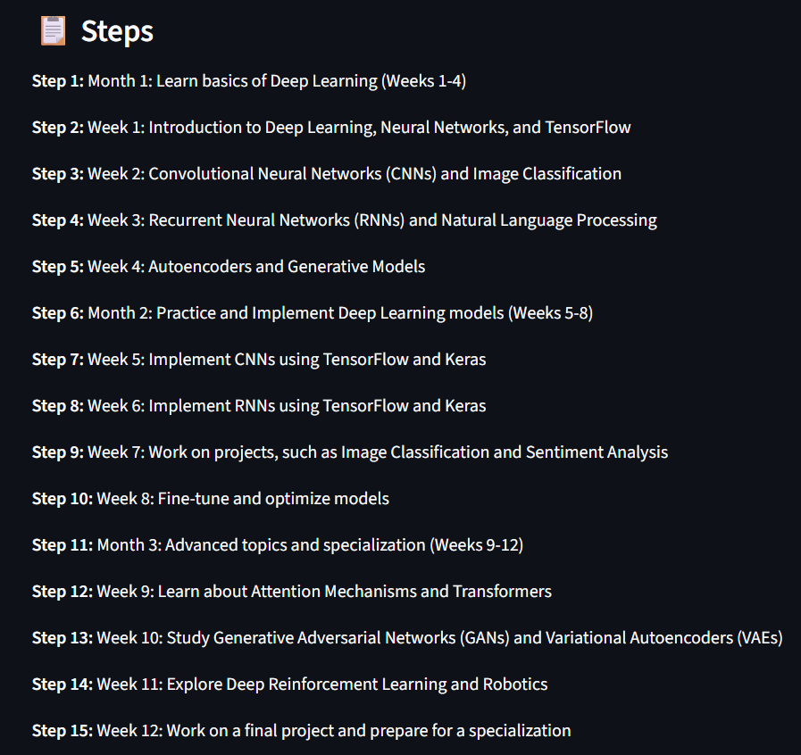

# AI Task Planner

An AI-powered roadmap and task planning application built using LangChain, Groq LLMs, Pydantic, and Streamlit.

The application generates structured step-by-step learning or project plans based on user goals.

---

## 🌐 Live Demo
👉 [Try it live here](https://ai-task-planner.streamlit.app/)

## 🚀 Demo

<p align="center">
  
  
</p>

## Features

- AI-generated task planning
- Step-by-step roadmap generation
- Structured outputs using Pydantic
- Interactive Streamlit UI
- LangChain prompt templates
- Fast inference using Groq LLMs
- Clean and beginner-friendly architecture

---

## Tech Stack

- Python
- Streamlit
- LangChain
- Groq API
- Pydantic
- dotenv

---

## Project Structure

```text
ai-task-planner/
│
├── screenshots/
│   ├── demo1.png
│   └── demo2.png
│
├── app.py
├── requirements.txt
├── .env
├── README.md
```

---

## Installation

### Clone the Repository

```bash
git clone https://github.com/your-username/ai-task-planner.git
cd ai-task-planner
```

---

### Create Virtual Environment

```bash
python -m venv venv
```

Activate environment:

#### Windows

```bash
venv\Scripts\activate
```

#### Mac/Linux

```bash
source venv/bin/activate
```

---

### Install Dependencies

```bash
pip install -r requirements.txt
```

---

## Environment Variables

Create a `.env` file in the root directory.

```env
GROQ_API_KEY=your_api_key_here
```

---

## Run the Application

```bash
streamlit run app.py
```

---

## Example Input

```text
Generate a 30-day roadmap to learn Generative AI
```

---

## Example Output

```text
Goal:
Learn Generative AI

Duration:
30 Days

Steps:
- Learn Python basics
- Understand NLP fundamentals
- Learn LangChain
- Build AI projects
```

---

## Future Improvements

- Export roadmap as PDF
- Multi-agent planning
- Calendar integration
- Save user history
- Vector database integration
- Advanced roadmap customization
- Authentication system

---

## Deployment

You can deploy this project using:

- Streamlit Community Cloud
- Render
- Hugging Face Spaces

---

## requirements.txt

```text
streamlit
langchain
langchain-groq
python-dotenv
pydantic
```

---

## Author

Bangaru Konda

---

## License

This project is licensed under the MIT License.